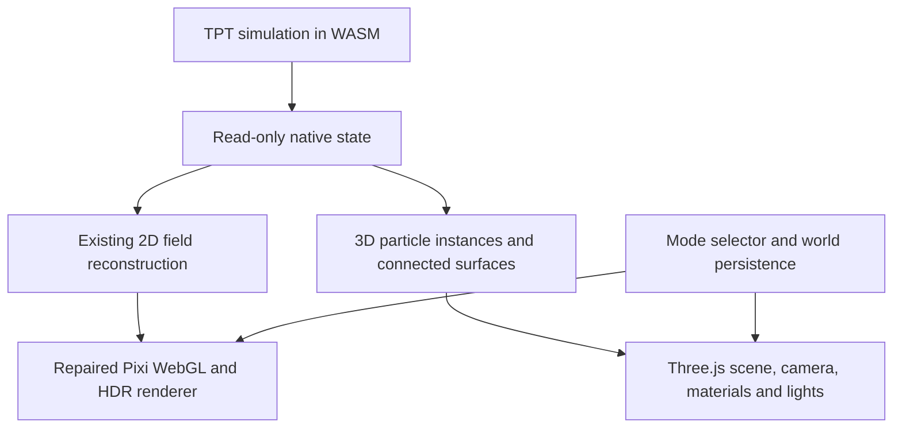

# Switchable 2D and 3D rendering

Revised 2026-09-26. The switchable rendering foundation below is delivered; see the progress document for evidence.

## Current focus: 2D materials and controls

The current request is to improve the existing Realistic WebGL view while preserving native TPT and the accepted Water surface. Animate the existing water reflection/refraction field together; give dense steam rolling light and shadow; retain dark crust in Lava's final glow; give settled Sand broad, stable material shading.

Make the 2D interface easier to operate, especially on desktop at larger display scales. Keep tool discovery, the current brush, its numeric radius, Draw/Eraser, playback and view reset accessible. Check the desktop arrangement at 125%, 150% and 200% equivalent scaling without changing to the mobile layout, and separately check touch. Validate rendered results and native painting/erasing/tools rather than relying solely on shader-source assertions.

The follow-up also simplifies unit tests that pin shader formulas, gives elements readable names with searchable native-code aliases, and verifies native tool behavior. Remove picker entries with no implemented user-visible behavior; preserve their native save identities. Keep physics, save/load, input and GPU failure tests.

## Goal

Restore the existing WebGL presentation and introduce a usable, switchable 3D rendering mode while retaining the TPT WebAssembly simulation. The 2D and 3D modes may have different interfaces and controls suited to their cameras and visual models. The studio should be an open, attractive scene with substantial material depth and a visually unbounded background. Settled sand must read as a solid pile.

Success means both modes run against native TPT state, the user can change modes without losing the world, and the 3D mode displays actual geometry with depth, lighting, and connected material surfaces. A capability probe or a synthetic scene alone does not complete this work.

## Simulation boundary

TPT remains authoritative for motion, collisions, reactions, heat, walls, and native saves. Its physics is two-dimensional. The renderer constructs substantial 3D bodies from that state: particles and connected bodies have rendered thickness, but no independently simulated z motion. Camera movement and perspective operate on real geometry. The visual background extends beyond view; the native editable simulation domain remains finite.

Preserve the current native solver and behavior. Reuse its read-only material/wall/state fields; add a read-only particle export only if needed for useful subcell motion. Geometry reconstruction and decorative depth must not write back into physics or become a replacement simulation. Both modes retain native save compatibility.

## Architecture

The current 2D pipeline reads TPT's 612 × 384 material, wall, temperature, velocity, and presentation-state fields. CPU reconstruction produces dirty-region liquid, powder, atmosphere, and emission fields. Pixi uploads those fields as textures, shades a screen-facing world surface, and applies HDR/bloom in Realistic mode. Physics targets 60 Hz; field presentation targets 30 Hz, with slower auxiliary updates. The 8× option uses a separate compact shader.

The 3D pipeline reads the same native material/wall state and groups occupied cells by material. Dense powder becomes closed rounded geometry; loose grains remain instances; liquids, solids and walls become joined beveled surfaces. Three.js draws them through a perspective camera with physical materials, procedural texture detail, environment light, shadows, contact occlusion and restrained bloom. Geometry updates are bounded separately from simulation stepping. Camera and brush interaction use a lighter direct render, followed by the full finish when interaction settles.

Use Three.js for the new mode. Start with its maintained WebGL2 renderer so real 3D works on the same class of browsers as the current application. WebGL is a full 3D graphics API; this mode has no Pixi dependency in its rendering path. WebGPU can follow a measured need for compute or additional rendering features, rather than block the first usable version.

The existing shader implementation is not a migration template for 3D materials. Use ordinary 3D material, geometry, camera, and lighting abstractions. Keep new code in dedicated application/renderer modules, and load the selected mode's implementation on demand.

## 1. Restore the existing WebGL mode

Reproduce the reported malfunction in the ordinary Realistic mode and the built application. Inspect browser errors, shader compilation, the actual selected backend, HDR support, and the displayed frame. A previously observed Realistic showcase capture timed out; determine whether that is a renderer fault, a capture assumption, or both.

Fix the actual failure and demonstrate a visible, responsive scene with native simulation running. Check painting, pause/resume, and a relevant save/load operation. Keep Classic and Canvas fallback behavior understandable. Use focused reproduction and regression checks, not the full historical visual experiment matrix.

Deliverable: a working old WebGL path with the cause and verification recorded in the progress document.

## 2. Build the first usable 3D mode

Present the simulation in an open scene without a rear board or perimeter box. Use substantial depth, an angled perspective camera, warm key/cool rim lighting, ground contact shadows, and a continuous fogged background. Give the user full azimuth orbit, zoom, pan, reset/front views, and draw/erase controls with clear interaction modes. Pick the visible geometry first and map its surface back to native cell ownership; use the simulation plane only in empty space. Retain essential material selection, brush size, pause, clear, and save/load controls; matching every 2D toolbar feature is not required.

| Material family | Initial 3D representation |
| --- | --- |
| Loose powders and isolated droplets | Batched or instanced geometry with actual depth and material color |
| Dense powders | Opaque, closed, rounded bulk surfaces with grain texture; join tiny air pores without changing native cells or swallowing foreign materials |
| Connected liquids | Reconstructed continuous meshes with smooth normals and finite thickness; preserve detached droplets and material boundaries |
| Solids and native walls | Joined surface geometry with depth; update changed regions rather than creating an object per cell |
| Gas and energy | Soft particle or volume-like presentation and emissive geometry where appropriate; remain distinguishable from opaque solids |

For merging, reconstruct an outer surface from connected material support. Merely concatenating sphere buffers does not create a merged liquid body. A contour with rounded depth is a useful initial representation for this planar simulation; a density field and marching cubes are options when additional surface freedom justifies their cost. Preserve holes, wall barriers, and separate material ownership.

Use physical transmission and attenuation for glass/water, fine grain/wood texture, and modest water surface normals. Keep silhouette and material identity clear. Contact occlusion excludes transmissive bodies and the editing cursor. Apply bloom to bright energy without washing out opaque materials. The target is legible depth and cohesive material bodies in both paused and moving native scenes.

Bound geometry resolution, instance counts, pixel ratio, and expensive reconstruction frequency. Reuse buffers and geometry where possible. Check live scenes as well as paused appearance; avoid rebuilt meshes visibly popping or detached visual history surviving edits.

Deliverable: a playable Three.js view of the existing TPT world, including visible particles, connected 3D bodies, camera controls, painting, and basic persistence.

## 3. Make the modes switchable

Expose a clear 2D / 3D selector in both interfaces. Preserve the world across a switch using the existing native save path or the same backend instance. Preserve the prior mode if saving or loading fails; show an actionable error instead of silently clearing the world.

The mode belongs in a shareable URL and may be remembered locally. Keep old links opening the familiar 2D mode unless they explicitly select 3D. Different layouts, camera controls, and quality settings are allowed. Release the outgoing renderer's animation callbacks, listeners, and GPU resources, or use a document transition that does so reliably.

If 3D initialization fails, provide a visible route back to 2D with the world intact. Verify 2D -> 3D -> 2D round trips and mode selection on reload.

## 4. Verify and deliver

Build the production artifact and run tests relevant to the renderer fault, geometry reconstruction, and mode switching. Review actual browser captures of both modes. Exercise a native world containing water, sand, solid boundaries, and energy/gas, plus painting and a paused world transition. Ensure the native backend really loaded rather than accepting a JavaScript fallback as proof.

Exercise editing from angled and back views, isolated grains, native walls, continuous draw/erase strokes, right-click erasing, out-of-world input and pointer release, camera gestures, and touch after resize. Verify the actual changed native cell, not only the cursor position. Preserve the complete paused native save through mode and native file round trips.

Record the renderer/backend, scene, and view for screenshots. Record frame or reconstruction timing with the hardware/browser identified. Software WebGL can establish execution and appearance, but cannot establish target-device performance.

Update NEXT_STEP_RENDER_PROGRESS.md and WORK_RESUME.md with implemented behavior, evidence, and concrete remaining limitations. The repository permits committing, pushing, and its existing deployment workflow when needed to deliver the authorized work.

## Later development

The switchable foundation and open-studio improvement are implemented; see [progress and evidence](NEXT_STEP_RENDER_PROGRESS.md). Next, review the moving studio on the user's GPU, then prioritize smoother liquid surfaces, less cell-stepped particle motion, gas/fire volume, and more local geometry updates. Use measured bottlenecks to choose further optimization. Consider WebGPU only with a functioning prototype on available hardware. Fully volumetric 3D physics would be a separate simulator project and is outside this goal.
